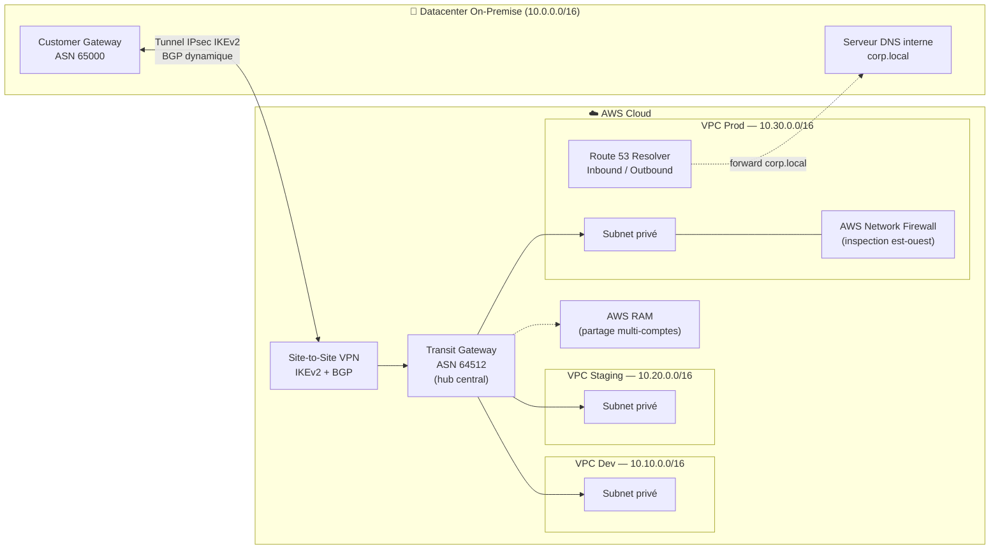

# 🔗 Connectivité Hybride Cloud — AWS Transit Gateway & Site-to-Site VPN

[](https://www.terraform.io/)
[](https://aws.amazon.com/)
[]()

## 🎯 Objectif du projet

Concevoir et déployer une architecture réseau **hub-and-spoke** connectant un datacenter
on-premise à trois environnements AWS (**Dev / Staging / Prod**) via **AWS Transit Gateway**,
avec une connectivité VPN chiffrée, un routage dynamique **BGP**, une résolution **DNS hybride**
et une inspection du trafic **est-ouest**.

Ce projet illustre des compétences réseau (BGP, VPN IPsec, plan d'adressage) appliquées à une
infrastructure cloud AWS, dans une logique d'architecte réseaux & cloud.

## 🏗️ Architecture



### Composants clés

| Composant | Rôle |
|---|---|
| **AWS Transit Gateway** | Hub central reliant les 3 VPC et le VPN on-premise (topologie hub-and-spoke) |
| **Site-to-Site VPN (IKEv2)** | Tunnel chiffré vers le datacenter, routage dynamique **BGP** (ASN 65000 ↔ 64512) |
| **Plan d'adressage CIDR** | `10.0.0.0/16` (on-prem), `10.10.0.0/16` (Dev), `10.20.0.0/16` (Staging), `10.30.0.0/16` (Prod) — sans chevauchement |
| **Route 53 Resolver** | Endpoints Inbound/Outbound pour résolution DNS hybride (`corp.local` ↔ zones privées AWS) |
| **AWS Network Firewall** | Inspection stateful du trafic est-ouest entre VPC |
| **AWS RAM** | Partage du Transit Gateway entre comptes AWS (organisation multi-comptes) |

## 📁 Structure du dépôt

```
.
├── terraform/
│   ├── versions.tf       # Provider AWS + contraintes de version
│   ├── variables.tf      # Plan d'adressage, ASN, région
│   ├── main.tf           # VPCs, TGW, VPN, Resolver, Network Firewall, RAM
│   └── outputs.tf        # IDs et informations de sortie
├── docs/
│   └── architecture.md   # Détails de conception (routage, BGP, DNS)
└── README.md
```

## 🚀 Déploiement

### Prérequis
- Un compte AWS avec les droits nécessaires (VPC, EC2, Transit Gateway, Route 53, Network Firewall, RAM)
- [Terraform](https://developer.hashicorp.com/terraform/downloads) >= 1.6
- AWS CLI configuré (`aws configure`)

### Étapes

```bash
git clone https://github.com/BakirAhmed/hybrid-cloud-transit-gateway-vpn.git
cd hybrid-cloud-transit-gateway-vpn/terraform

terraform init
terraform plan -out=tfplan
terraform apply tfplan
```

> ⚠️ Ce projet crée des ressources facturées (Transit Gateway, VPN, Network Firewall).
> Pensez à faire `terraform destroy` après démonstration.

### Destruction de l'environnement

```bash
terraform destroy
```

## 🧠 Points techniques abordés

- Conception d'un **plan d'adressage CIDR** multi-environnements sans chevauchement
- Topologie **hub-and-spoke** avec Transit Gateway et tables de routage dédiées
- **BGP** sur tunnel VPN IPsec (annonce dynamique des routes, ASN on-prem vs Amazon)
- **DNS hybride** via Route 53 Resolver (forwarding conditionnel de zone)
- Inspection **est-ouest** avec Network Firewall (stateful rule groups)
- Partage de ressources réseau entre comptes via **AWS RAM**

## 🔮 Améliorations futures

- [ ] Ajouter une deuxième connexion VPN pour la redondance (tunnel actif/actif)
- [ ] Comparer avec une implémentation Direct Connect
- [ ] Ajouter des tests automatisés (Terratest) et un pipeline CI/CD
- [ ] Diagramme d'architecture exporté en image (draw.io) dans `docs/`

## 👤 Auteur

**Ahmed Bakir** — Étudiant Ingénieur Réseaux & Cloud (EPSI Lyon / ENIG)
[LinkedIn](https://linkedin.com/in/ahmed-bk) · [GitHub](https://github.com/BakirAhmed)
